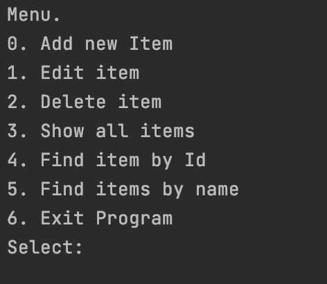

# job4j_tracker

This project represents basic CRUD console application and demonstrates OOP principles.

#### Functionality:
- CRUD operations for items
- Console UI

#### Used technologies:
- JDBC for manipulating with DB
- Slf4j for logging

